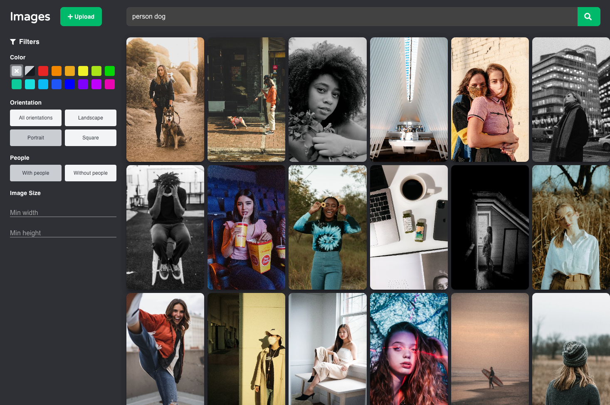

# Image Repository

It includes a complete front and back-end, as well as an AI powered microservice that provides automatic 
tagging of prominent image features. I had a ton of fun working on this, even though it did end up being 
a lot more than I originally set out to do. Below, you can find a description of the different components, 
some  instructions on how to run it, and finally some screenshots of the front-end.

## Structure

#### Overview
```
.
├── client   # front-end
├── examples # example screenshots
├── nginx    # nginx configuration
├── resizer  # microservice
├── scripts  # misc. scripts
├── server   # back-end
└── tagger   # microservice
```

#### Client

Front-end written in typescript using react and redux. The LayoutEngine is the class 
responsible for laying out the images into nice square grids (most of the time). Since
design isn't my strong suit, I ended up taking a number of concepts and themes from both
Imgur and Shutterstock.

#### Resizer

A microservice written in python that generates scaled down versions of 
images for use as thumbnails. This was added to hopefully address the poor
performance in the gallery view caused by large resolution images downloaded
from unsplash. *Update* - this worked really well and performance is now a lot better.

#### Scripts

Contains miscellaneous scripts used during development. The `upload_images.py`
script makes it easy to upload an entire folder of images. Simply pass the path
to the folder of images when calling the file. Example: `upload_images.py <path>`

#### Server

This the main server and it's built with RoR configured in API only mode. It can
operate independently of the two microservices. This is my first project ever in
both Ruby and Rails so please forgive any anti-patterns or bad code. The api is fully
documented in the controller's but in short it supports:

- Getting images and image thumbnails
- Uploading single/multiple images
- Editing/deleting images
- Searching images using a number of criteria (powered by elasticsearch)
- Secret key based authentication for editing/deleting images
- Add/delete tags

I tried to use as many of these things in the front-end as possible to showcase the 
different things it supports, but some things may have been left out for time.


#### Tagger

A microservice written in python that analyzes and generates tags for images using
AI. Before this project, I wanted to learn more about machine learning so I experimented
with a number of different frameworks including pytorch, tensorflow, detectron2. In the
end, the best combination of perfomance, number of classes and accuracy was acheived by
using three different pre-trained models running on pytorch: YOLO v5, Shufflenet v2 and
Mobilenet v2.  The multiple modles, in combination with the hand-annotated labels results 
in pretty accurate tags being generated for most images. The tagger performs the best with
images  of people, animals and more common household objects. It won't produce any results 
for non-photo images.

## Setup

*Note* - Both the tagger and resizer require Python 3.8.

1. `docker-compose up`
2. `cd client && npm install && npm start`
3. `cd server && rails s`
4. `cd tagger && pip install -r requirements.txt && python main.py`
5. `cd resizer && pip install -r requirements.txt && python main.py`

The last two are technically optional but highly recommended.

### Getting Example Images

A good place to download sample images in bulk is from [http://unsample.net/](http://unsample.net/).
Select the number of images you wish, click download and unzip the folder. Then use the `upload_images.py`
script in `/scripts` to upload the entire folder at once. Depending on how many images are in the folder, 
this can take a couple of minutes to do, and may produce a couple of 504 errors along the way.


## Screenshots





